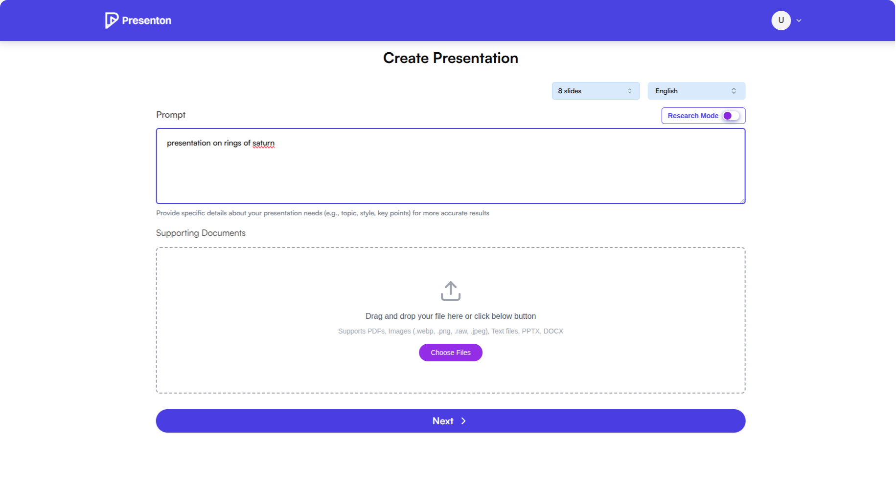
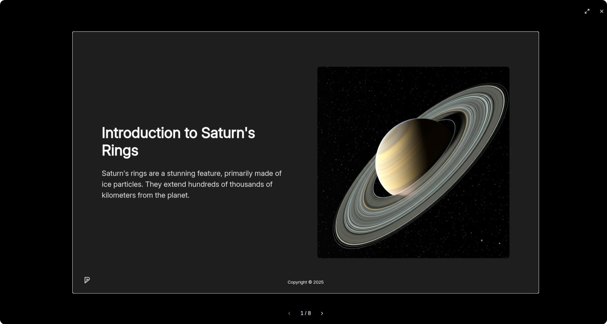

<p align="center">
  
</p>

<p align="center">
  <a href="https://discord.gg/9ZsKKxudNE">
    
  </a>
</p>


# Open-Source AI Presentation Generator and API (Gamma Alternative)


**Presenton** is an open-source application for generating presentations with AI — all running locally on your device. Stay in control of your data and privacy while using models like OpenAI and Gemini, or use your own hosted models through Ollama.


> [!IMPORTANT]
> Like Presenton? A ⭐ star shows your support and encourages us to keep building!

> [!TIP]
> For detailed setup guides, API documentation, and advanced configuration options, visit our **[Official Documentation](https://docs.presenton.ai)**


## ✨ More Freedom with AI Presentations

* ✅ **Bring Your Own Key** — Only pay for what you use. OpenAI, Gemini (More coming soon...)
* ✅ **API Presentation Generation** — Host as API to generate presentations over requests
* ✅ **Ollama Support** — Run open-source models locally with Ollama integration
* ✅ **OpenAI API Compatibility** — Use any OpenAI-compatible API endpoint with your own models
* ✅ **Versatile Image Generation** — Choose from DALL-E 3, Gemini Flash, Pexels, or Pixabay for your visuals
* ✅ **Runs Locally** — All code runs on your device
* ✅ **Privacy-First** — No tracking, no data stored by us
* ✅ **Flexible** — Generate presentations from prompts or outlines
* ✅ **Export Ready** — Save as PowerPoint (PPTX) and PDF
* ✅ **Fully Open-Source** — Apache 2.0 licensed

## Deploy on Cloud (one click deployment)
[](https://railway.com/deploy/presenton-ai-presentations?referralCode=ubp0kk)

## Running Presenton Docker

#### 1. Start Presenton

##### Linux/MacOS (Bash/Zsh Shell):
```bash
docker run -it --name presenton -p 5000:80 -v "./user_data:/app/user_data" ghcr.io/presenton/presenton:latest
```

##### Windows (PowerShell):
```bash
docker run -it --name presenton -p 5000:80 -v "${PWD}\user_data:/app/user_data" ghcr.io/presenton/presenton:latest
```

#### 2. Open Presenton
Open http://localhost:5000 on browser of your choice to use Presenton.

> **Note: You can replace 5000 with any other port number of your choice to run Presenton on a different port number.**

## Deployment Configurations

You may want to directly provide your API KEYS as environment variables and keep them hidden. You can set these environment variables to achieve it.

- **CAN_CHANGE_KEYS=[true/false]**: Set this to **false** if you want to keep API Keys hidden and make them unmodifiable.
- **LLM=[openai/google/ollama/custom]**: Select **LLM** of your choice.
- **OPENAI_API_KEY=[Your OpenAI API Key]**: Provide this if **LLM** is set to **openai**
- **GOOGLE_API_KEY=[Your Google API Key]**: Provide this if **LLM** is set to **google**
- **OLLAMA_URL=[Custom Ollama URL]**: Provide this if you want to custom Ollama URL and **LLM** is set to **ollama**
- **OLLAMA_MODEL=[Ollama Model ID]**: Provide this if **LLM** is set to **ollama**
- **CUSTOM_LLM_URL=[Custom OpenAI Compatible URL]**: Provide this if **LLM** is set to **custom**
- **CUSTOM_LLM_API_KEY=[Custom OpenAI Compatible API KEY]**: Provide this if **LLM** is set to **custom**
- **CUSTOM_MODEL=[Custom Model ID]**: Provide this if **LLM** is set to **custom**

You can also set the following environment variables to customize the image generation provider and API keys:

- **IMAGE_PROVIDER=[pexels/pixabay/gemini_flash/dall-e-3]**: Select the image provider of your choice.
  - Defaults to **dall-e-3** for OpenAI models, **gemini_flash** for Google models if not set.
- **PEXELS_API_KEY=[Your Pexels API Key]**: Required if using **pexels** as the image provider.
- **PIXABAY_API_KEY=[Your Pixabay API Key]**: Required if using **pixabay** as the image provider.
- **GOOGLE_API_KEY=[Your Google API Key]**: Required if using **gemini_flash** as the image provider.
- **OPENAI_API_KEY=[Your OpenAI API Key]**: Required if using **dall-e-3** as the image provider.

> **Note:** You can freely choose both the LLM (text generation) and the image provider. Supported image providers: **pexels**, **pixabay**, **gemini_flash** (Google), and **dall-e-3** (OpenAI).

### Using OpenAI
```bash
docker run -it --name presenton -p 5000:80 -e LLM="openai" -e OPENAI_API_KEY="******" -e CAN_CHANGE_KEYS="false" -v "./user_data:/app/user_data" ghcr.io/presenton/presenton:latest
```

### Using Ollama
```bash
docker run -it --name presenton -p 5000:80 -e LLM="ollama" -e OLLAMA_MODEL="llama3.2:3b" -e PEXELS_API_KEY="*******" -e CAN_CHANGE_KEYS="false" -v "./user_data:/app/user_data" ghcr.io/presenton/presenton:latest
```

### Using OpenAI Compatible API
```bash
docker run -it -p 5000:80 -e CAN_CHANGE_KEYS="false"  -e LLM="custom" -e CUSTOM_LLM_URL="http://*****" -e CUSTOM_LLM_API_KEY="*****" -e CUSTOM_MODEL="llama3.2:3b" -v "./user_data:/app/user_data" ghcr.io/presenton/presenton:latest
```

#### Running Presenton with GPU Support

To use GPU acceleration with Ollama models, you need to install and configure the NVIDIA Container Toolkit. This allows Docker containers to access your NVIDIA GPU.

Once the NVIDIA Container Toolkit is installed and configured, you can run Presenton with GPU support by adding the `--gpus=all` flag:

```bash
docker run -it --name presenton --gpus=all -p 5000:80 -e LLM="ollama" -e OLLAMA_MODEL="llama3.2:3b" -e PEXELS_API_KEY="*******" -e CAN_CHANGE_KEYS="false" -v "./user_data:/app/user_data" ghcr.io/presenton/presenton:latest
```

> **Note:** GPU acceleration significantly improves the performance of Ollama models, especially for larger models. Make sure you have sufficient GPU memory for your chosen model.

## Generate Presentation over API

### Generate Presentation

Endpoint: `/api/v1/ppt/generate/presentation`

Method: `POST`

Content-Type: `multipart/form-data`

> **Note**: Make sure to set `Content-Type` as `multipart/form-data` and not `application/json`.

#### Request Body

| Parameter | Type | Required | Description |
|-----------|------|----------|-------------|
| prompt | string | Yes | The main topic or prompt for generating the presentation |
| n_slides | integer | No | Number of slides to generate (default: 8, min: 5, max: 15) |
| language | string | No | Language for the presentation (default: "English") |
| theme | string | No | Presentation theme (default: "light"). Available options: "light", "dark", "cream", "royal_blue", "faint_yellow", "light_red", "dark_pink" |
| documents | File[] | No | Optional list of document files to include in the presentation. Supported file types: PDF, TXT, PPTX, DOCX |
| export_as | string | No | Export format ("pptx" or "pdf", default: "pptx") |

#### Response

```json
{
    "presentation_id": "string",
    "path": "string",
    "edit_path": "string"
}
```

#### Example Request

```bash
curl -X POST http://localhost:5000/api/v1/ppt/generate/presentation \
  -F "prompt=Introduction to Machine Learning" \
  -F "n_slides=5" \
  -F "language=English" \
  -F "theme=light" \
  -F "export_as=pptx"
```

#### Example Response

```json
{
  "presentation_id": "d3000f96-096c-4768-b67b-e99aed029b57",
  "path": "/static/user_data/d3000f96-096c-4768-b67b-e99aed029b57/Introduction_to_Machine_Learning.pptx",
  "edit_path": "/presentation?id=d3000f96-096c-4768-b67b-e99aed029b57"
}
```

> **Note:** Make sure to prepend your server's root URL to the path and edit_path fields in the response to construct valid links.

For detailed info checkout [API documentation](https://docs.presenton.ai/using-presenton-api).

### API Tutorials
- [Generate Presentations via API in 5 minutes](https://docs.presenton.ai/tutorial/generate-presentation-over-api)
- [Create Presentations from CSV using AI](https://docs.presenton.ai/tutorial/generate-presentation-from-csv)
- [Create Data Reports Using AI](https://docs.presenton.ai/tutorial/create-data-reports-using-ai)

## Roadmap
- [ ] Support for custom HTML templates by developers
- [ ] Support for accessing custom templates over API
- [ ] Implement MCP server
- [ ] Ability for users to change system prompt
- [X] Support external SQL database


## UI Features

### 1. Add prompt, select number of slides and language


### 2. Select theme


### 3. Review and edit outline


### 4. Select theme


### 5. Present on app


### 6. Change theme


### 7. Export presentation as PDF and PPTX


## Community
[Discord](https://discord.gg/9ZsKKxudNE)

## License

Apache 2.0
