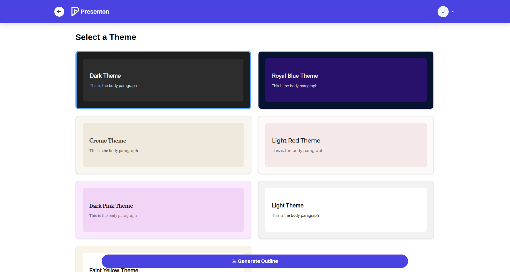
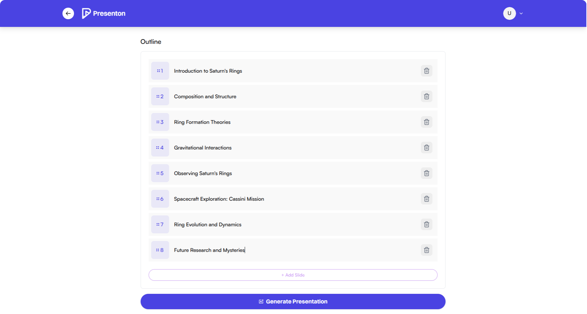
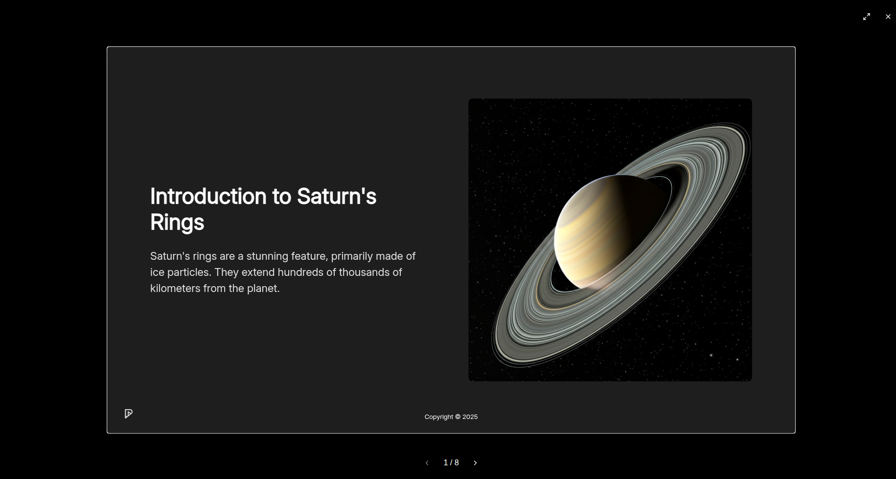
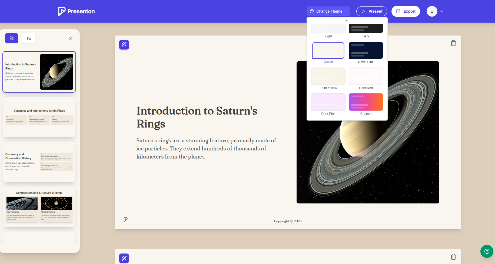

# Presenton: Open-Source, Locally-Run AI Presentation Generator - Gamma Alternative

---

**Presenton** is an open-source app that runs locally on your device, giving you full control over your presentation workflow. Generate beautiful decks using powerful AI models like OpenAI, Gemini, and others — all while keeping your data private and yourself compliant. You bring your own API keys and choose the provider to pay for only what you use. 

---

## ✨ More Freedom with AI Presentations

* ✅ **Bring Your Own Key** — Only pay for what you use. OpenAI, Gemini (More coming soon...)
* ✅ **Runs Locally** — All code runs on your device
* ✅ **Privacy-First** — No tracking, no data stored by us
* ✅ **Flexible** — Generate presentations from prompts or outlines
* ✅ **Export Ready** — Save as PowerPoint (PPTX) and PDF
* ✅ **Fully Open-Source** — Apache 2.0 licensed

## Features

### Add prompt, select number of slides and language

### Select theme

### Review and edit outline

### Generate presentation

### Present on app

### Change theme

### Export presentation

